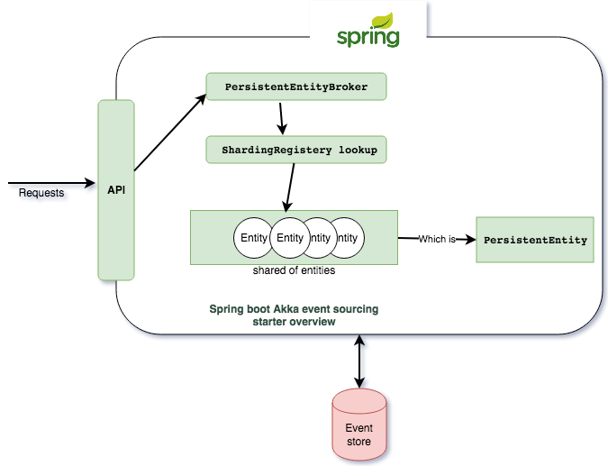

# Spring boot akka event sourcing starter 
[](https://app.codacy.com/app/Romeh/spring-boot-akka-event-sourcing-starter?utm_source=github.com&utm_medium=referral&utm_content=Romeh/spring-boot-akka-event-sourcing-starter&utm_campaign=Badge_Grade_Dashboard)
[](https://search.maven.org/search?q=g:io.github.romeh%20AND%20a:springboot-akka-event-sourcing-starter)



- Spring boot akka persistence event sourcing starter that cover the following :Smooth integration between Akka persistence and Spring Boot 2
- Generic DSL for the aggregate flow definition for commands and events

- Abstract Aggregate persistent entity actor with all common logic in place and which can be used with the concrete managed spring beans implementation of different aggregate entities
- Abstract cluster sharding run-time configuration and access via spring boot custom configuration and a generic entity broker that abstract the cluster shading implementation for you
- Abstracted mixed configuration for your actor system and the entity configuration via spring configuration and akka configuration


For how to use the event sourcing starter toolkit , you need to add the following maven dependency:
Maven dependency 
````
        <dependency>
                   <groupId>io.github.romeh</groupId>
                   <artifactId>springboot-akka-event-sourcing-starter</artifactId>
                   <version>1.0.2</version>
        </dependency>
````


For detailed technical details and explanation , check my 4 parts blog posts: 

- Part 1:https://mromeh.com/2018/04/27/spring-boot-akka-event-sourcing-starter-part-1/
- Part 2:https://mromeh.com/2018/04/27/spring-boot-akka-event-sourcing-starter-part-2/
- Part 3:https://mromeh.com/2018/04/27/spring-boot-akka-event-sourcing-starter-part-3-the-working-example/ 
- Part 4:https://mromeh.com/2018/04/27/spring-boot-akka-event-sourcing-starter-part-4-final/ 


Spring boot , Akka and Ignite used versions:
--------------

Spring boot 2.1.0.RELEASE+, Akka version :2.5.18+ , Ignite Version :2.6.0+
