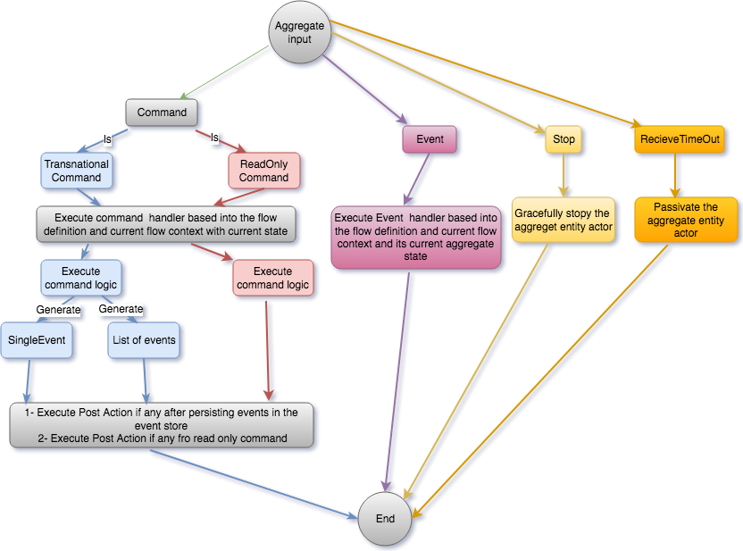

# Spring boot akka event sourcing starter 


- Spring boot akka persistence event sourcing starter that cover the following :Smooth integration between Akka persistence and Spring Boot
- Generic DSL for the aggregate flow definition for commands and events

- Abstract Aggregate persistent entity actor with all common logic in place and which can be used with the concrete managed spring beans implementation of different aggregate entities
- Abstract cluster sharding run-time configuration and access via spring boot custom configuration and a generic entity broker that abstract the cluster shading implementation for you
- Abstracted mixed configuration for your actor system and the entity configuration via spring configuration and akka configuration


For how to use the event sourcing starter toolkit , you need to add the following maven dependency:
Maven dependency 
````
        <dependency>
                   <groupId>io.github.romeh</groupId>
                   <artifactId>springboot-akka-event-sourcing-starter</artifactId>
                   <version>1.0</version>
        </dependency>
````


For detailed technical details and explanation , check my 4 parts blog posts: 
- Part 1:
- Part 2:
- Part 3: 
- Part 4: 


Spring boot , Akka and Ignite used versions:
--------------

Spring boot 1.5.9.RELEASE, Akka version :2.5.9+ , Ignite Version :2.3.0+