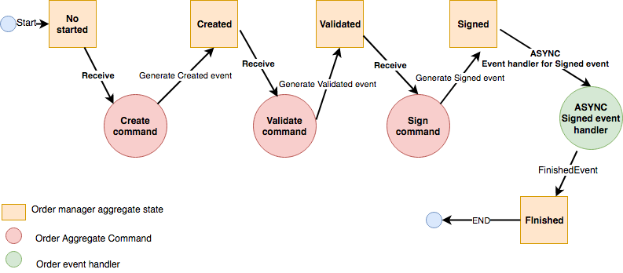

# Spring boot akka event sourcing starter working example

The order manager aggregate flow will be as the following :

For more detailed explanation of the how the example application implemented and how it work ,
Please check my blog post :

- Part 3:https://mromeh.com/2018/04/27/spring-boot-akka-event-sourcing-starter-part-3-the-working-example/ 
